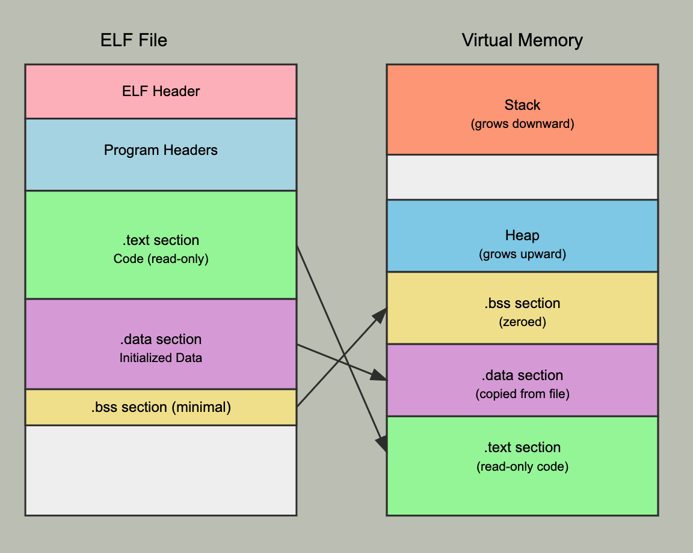

# Design docs

First of all, the argv pointers to all argments for the program is passed to the runtask function. For example, run do-nothing a b c will result in a pointer to a pointer of characters that hold run, do-nothing, a, b, c.

The string passed in process_execute actually already contains all you need. For example, ... run "ls a b c"

String constant will already contain ls a b c for you

:check: With multiple args, load will fail because it loads "ls a b c" instead of "ls"

:check: where do we set up the stack? In start_process makes the most sense

:check: How does it jump to _start?

:check: How does it achieve stack alignment?

:check: Where should this be done? In load because the esp points to the start of the user virtual memory PHYS_BASE after the stack is set up. This could be done either in the function itself or another function called prepare argments.

:check: Assuming we set up the arguments in the stack correctly, how does it jump to start the program?

Need to think about test cases

1. When the user program is compiled, it was compiled with user.Lds and entry.c and other debugging files to lay out the memory properly and set up the entry of the program. This entry called _started. When the kernel load the program, it points ```eip``` to ```_start``` of the program.

2. ```*eip = (void (*)(void))ehdr.e_entry;```

# Stack Layout (From Higher to Lower Addresses)

| **Stack Address** | **Field**          | **Size**   | **Explanation**                  |
|--------------------|--------------------|------------|----------------------------------|
| `ESP + 76`         | `ss`              | 2 bytes    | Optional, saved by CPU.          |
| `ESP + 72`         | `esp`             | 4 bytes    | Optional, saved by CPU.          |
| `ESP + 68`         | `eflags`          | 4 bytes    | Saved by CPU.                    |
| `ESP + 64`         | **padding**       | 2 bytes    | Aligns next field to 4 bytes.    |
| `ESP + 64`         | `cs`              | 2 bytes    | Saved by CPU.                    |
| `ESP + 60`         | `eip`             | 4 bytes    | Saved by CPU.                    |
| `ESP + 56`         | `frame_pointer`   | 4 bytes    | Saved by `pushl %ebp`.           |
| `ESP + 52`         | `error_code`      | 4 bytes    | Pushed by CPU or stub.           |
| `ESP + 48`         | `vec_no`          | 4 bytes    | Saved by `intrNN_stub`.          |
| `ESP + 46`         | **padding**       | 2 bytes    | Aligns next field to 4 bytes.    |
| `ESP + 44`         | `ds`              | 2 bytes    | Saved by `pushl %ds`.            |
| `ESP + 42`         | **padding**       | 2 bytes    | Aligns next field to 4 bytes.    |
| `ESP + 40`         | `es`              | 2 bytes    | Saved by `pushl %es`.            |
| `ESP + 38`         | **padding**       | 2 bytes    | Aligns next field to 4 bytes.    |
| `ESP + 36`         | `fs`              | 2 bytes    | Saved by `pushl %fs`.            |
| `ESP + 34`         | **padding**       | 2 bytes    | Aligns next field to 4 bytes.    |
| `ESP + 32`         | `gs`              | 2 bytes    | Saved by `pushl %gs`.            |
| `ESP + 28`         | `eax`             | 4 bytes    | Saved by `pushal`.               |
| `ESP + 24`         | `ecx`             | 4 bytes    | Saved by `pushal`.               |
| `ESP + 20`         | `edx`             | 4 bytes    | Saved by `pushal`.               |
| `ESP + 16`         | `ebx`             | 4 bytes    | Saved by `pushal`.               |
| `ESP + 12`         | `esp_dummy`       | 4 bytes    | Saved by `pushal`.               |
| `ESP + 8`          | `ebp`             | 4 bytes    | Saved by `pushal`.               |
| `ESP + 4`          | `esi`             | 4 bytes    | Saved by `pushal`.               |
| `ESP`              | `edi`             | 4 bytes    | Saved by `pushal`.               |

```c
/*Runs the task specified in ARGV[1]. */
static void run_task(char** argv) {
  const char* task = argv[1];
  printf("Executing '%s':\n", task);
# ifdef USERPROG
  process_wait(process_execute(task));
# endif
  printf("Execution of '%s' complete.\n", task);
}
```

```process_execute``` will then execute ```thread_create```

t = palloc_get_page(PAL_ZERO);
Purpose: Allocates memory for the new thread structure (struct thread) from the kernel's page allocator.
Flag Used: PAL_ZERO ensures that the allocated memory is zeroed ouailure Case: If memory allocation fails, the function returns TID_ERROR.

init_thread(t, name, priority);
Purpose: Initializes the thread's structure:
Sets its name.
Sets its priority.
Initializes other fields such as state, stack pointer, and list entries.
Why: Every thread must be properly initialized before use.

# Process Control Syscalls

[How] You are not allowed to have the kernel crash while trying to dereference an invalid or null pointer.

Try to avoid writing large amounts of repetitive code for implementing system calls. Each system call argument, whether an integer or a pointer, takes up 4 bytes on the stack. You should be able to take advantage of this to avoid writing much near-identical code for retrieving each system call’s arguments from the stack.

Beware: a 4-byte memory region (e.g. a 32-bit integer) may consist of 2 bytes of valid memory and 2 bytes of invalid memory, if the memory lies on a page boundary. You should handle these cases by terminating the user process => an integer could lie on the boundary.

What about the cases where dereferencing a pointer taking us to a kernel space? Need to check this as well

How does syscall work? Where does it start? How does the transition occur?

- Basically we validate the arguments, push them to the stack and then call INT 30

When a system call is called. The following steps happened:

1. Depending on the call, one of the following function will be called with appropritate args passed in:

- syscall0
- syscall1
- syscall1f
- syscall2
- syscall3

Each of these functions has a NUMBER which is a specifier for which system call. All of these enums are in syscall-nr.h

These syscall performs assembly instruction that pushes the NUMBER and the arguments onto the user stack, then perform int $0x30, which is essentially a trap to handler system call specifically

When this is called, it saves the CPU state, perform mode transitioning from user to kernel mode, then jump to intr_handler.

When the OS is booted, it has already set up intr_handler via syscall_init, intr_handler is essentially syscall_handler. This syscall_handler is actually the place we will handle all of our system call logic depending the NUMBER.

We already have an example with for calling exit(0).

Right now, we have no checks to validate the arguments to make sure the parameters are not accessing kernel memory.

We will create a function to perform this check in syscal.c file.

Notice that we either have 1, 2, or 3 arguments. We also know which syscall has how many arguments, so we could write a generic code to handle each one accordingly. I don't know how this would look like yet.

What exactly are being passed? Most arguments are either an int, a pointer, or an unsigned number. We have to make sure the pointer is not pointing to kernel.

How do I write my own tests?

```c
  if (args[0] == SYS_EXIT) {
    f->eax = args[1];
    printf("%s: exit(%d)\n", thread_current()->pcb->process_name, args[1]);
    process_exit();
  }
```

```c
void syscall_init(void) { intr_register_int(0x30, 3, INTR_ON, syscall_handler, "syscall"); }
```

```c
/* Invokes syscall NUMBER, passing argument ARG0, and returns the
   return value as an `int'. */
#define syscall1(NUMBER, ARG0)                                                                     \
  ({                                                                                               \
    int retval;                                                                                    \
    asm volatile("pushl %[arg0]; pushl %[number]; int $0x30; addl $8, %%esp"                       \
                 : "=a"(retval)                                                                    \
                 : [number] "i"(NUMBER), [arg0] "g"(ARG0)                                          \
                 : "memory");                                                                      \
    retval;                                                                                        \
  })
```


