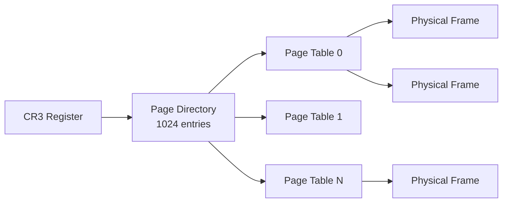

import MemoryLayout from '@site/src/components/MemoryLayout';

# Memory Layout

PintOS uses a split virtual address space with the kernel in high memory and user programs in low memory.

## Virtual Address Space

<MemoryLayout
  title="Virtual Address Space Layout"
  regions={[
    {
      id: 'kernel',
      label: 'Kernel Space',
      startAddress: '0xC0000000',
      endAddress: '0xFFFFFFFF',
      size: '1 GB',
      color: 'kernel',
      description: 'Direct-mapped to physical memory. All kernel code, data, and per-thread kernel stacks.',
    },
    {
      id: 'user-stack',
      label: 'User Stack',
      startAddress: '0xBFFFFFFF',
      endAddress: '0xC0000000',
      size: 'Grows ↓',
      color: 'stack',
      description: 'Stack grows downward from PHYS_BASE. Faults cause stack growth.',
    },
    {
      id: 'mmap',
      label: 'Memory-Mapped Region',
      startAddress: '0x10000000',
      endAddress: '0xBFFFFFFF',
      size: '~3 GB',
      color: 'heap',
      description: 'mmap() allocations. File-backed pages loaded on demand.',
    },
    {
      id: 'heap',
      label: 'User Heap',
      startAddress: 'varies',
      endAddress: 'varies',
      size: 'Grows ↑',
      color: 'heap',
      description: 'Dynamic allocations via malloc(). Not implemented in base PintOS.',
    },
    {
      id: 'bss',
      label: 'BSS Segment',
      startAddress: 'varies',
      endAddress: 'varies',
      color: 'data',
      description: 'Uninitialized global variables. Zero-filled on load.',
    },
    {
      id: 'data',
      label: 'Data Segment',
      startAddress: 'varies',
      endAddress: 'varies',
      color: 'data',
      description: 'Initialized global variables. Loaded from ELF.',
    },
    {
      id: 'code',
      label: 'Code Segment',
      startAddress: '0x08048000',
      endAddress: 'varies',
      color: 'code',
      description: 'Executable code (.text section). Read-only, executable.',
    },
    {
      id: 'unmapped',
      label: 'Unmapped',
      startAddress: '0x00000000',
      endAddress: '0x08048000',
      color: 'free',
      description: 'Reserved. NULL pointer accesses fault here.',
    },
  ]}
/>

## Key Constants

```c
#define PHYS_BASE    0xC0000000  /* Start of kernel virtual memory */
#define LOADER_BASE  0x20000     /* Where kernel is loaded */
#define PGSIZE       4096        /* Page size (4 KB) */
#define PGMASK       0xFFF       /* Page offset mask */
```

## Address Translation

### User → Physical (via Page Table)

```
Virtual Address: 0x0804ABCD
┌─────────────────┬─────────────────┬──────────────┐
│  Directory (10) │    Table (10)   │  Offset (12) │
│      0x020      │      0x04A      │     0xBCD    │
└────────┬────────┴────────┬────────┴───────┬──────┘
         │                 │                │
         ▼                 ▼                ▼
    Page Directory    Page Table      Physical Page
    [0x020] ────────► [0x04A] ────────► + 0xBCD
                                        ════════
                                        Physical Addr
```

### Kernel → Physical (Direct Mapping)

For kernel addresses, translation is simple:

```c
/* Kernel virtual to physical */
physical = virtual - PHYS_BASE;

/* Physical to kernel virtual */
virtual = physical + PHYS_BASE;
```

Example:
```
Kernel VA:  0xC0100000
Physical:   0x00100000  (0xC0100000 - 0xC0000000)
```

## Thread Memory Layout

Each thread has a 4 KB page containing its stack and `struct thread`:

```
                 4 KB Page
        ┌───────────────────────┐ ← High address
        │     struct thread     │
        │   (grows downward)    │
        │   ─────────────────   │
        │                       │
        │    Kernel Stack       │
        │    (grows upward)     │
        │         ↓             │
        │                       │
        │        ...            │
        │                       │
        │         ↑             │
        │   Stack grows here    │
        │                       │
        └───────────────────────┘ ← Low address

thread_current() = pg_round_down(esp)
```

## Page Table Structure

PintOS uses x86 two-level paging:



### Page Directory Entry

```
31                                  12 11      0
┌──────────────────────────────────────┬────────┐
│     Page Table Physical Address      │ Flags  │
└──────────────────────────────────────┴────────┘

Flags:
  Bit 0 (P)   - Present
  Bit 1 (R/W) - Read/Write
  Bit 2 (U/S) - User/Supervisor
  Bit 5 (A)   - Accessed
  Bit 6 (D)   - Dirty
```

### Page Table Entry

Same format as PDE, but points to physical frame instead of page table.

## Physical Memory Layout

```
┌────────────────────────────────────┐ 0xFFFFFFFF
│         Not Usable (>1GB)          │
├────────────────────────────────────┤
│                                    │
│      User Physical Frames          │
│         (palloc pool)              │
│                                    │
├────────────────────────────────────┤
│      Kernel Physical Frames        │
│         (palloc pool)              │
├────────────────────────────────────┤
│         Kernel Code/Data           │
├────────────────────────────────────┤ ~0x100000 (1MB)
│       BIOS / Video Memory          │
├────────────────────────────────────┤ 0xA0000
│         Low Memory                 │
└────────────────────────────────────┘ 0x00000000
```

## Frame Allocation

Frames are allocated from two pools:

```c
/* Kernel pool - for kernel data structures */
palloc_get_page(PAL_ZERO);  /* Zero-filled */

/* User pool - for user pages */
palloc_get_page(PAL_USER | PAL_ZERO);
```

## Next Steps

- [Source Tree Guide](/docs/architecture/source-tree) - File organization
- [Virtual Memory Concepts](/docs/concepts/virtual-memory) - How VM works
