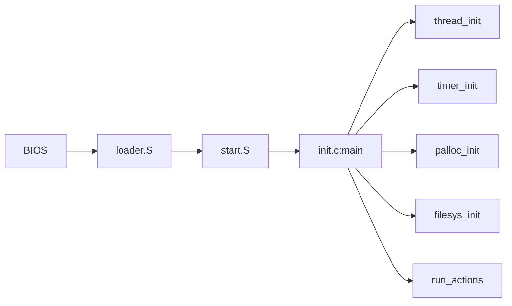

import InteractiveDiagram from '@site/src/components/InteractiveDiagram';

# Architecture Overview

PintOS is structured as a monolithic kernel with four main subsystems. This page provides a visual overview of the architecture.

## System Architecture

The following diagram shows the major components and their relationships:

<InteractiveDiagram
  title="PintOS Architecture"
  nodes={[
    { id: 'user', label: 'User Programs', x: 300, y: 20, width: 200, height: 40, color: '#3b82f6', link: '/docs/projects/userprog/overview', description: 'User-space applications running in isolated address spaces' },
    { id: 'syscall', label: 'System Call Interface', x: 250, y: 80, width: 300, height: 40, color: '#8b5cf6', link: '/docs/concepts/system-calls', description: 'int 0x30 handler dispatching to kernel services' },
    { id: 'process', label: 'Process Mgmt', x: 50, y: 160, width: 130, height: 50, color: '#22c55e', link: '/docs/projects/userprog/process-management', description: 'fork(), exec(), wait(), exit()' },
    { id: 'vm', label: 'Virtual Memory', x: 200, y: 160, width: 130, height: 50, color: '#22c55e', link: '/docs/projects/vm/overview', description: 'Demand paging, frame table, swap' },
    { id: 'filesys', label: 'File System', x: 350, y: 160, width: 130, height: 50, color: '#22c55e', link: '/docs/projects/filesys/overview', description: 'Buffer cache, inodes, directories, WAL' },
    { id: 'devices', label: 'Device Drivers', x: 500, y: 160, width: 130, height: 50, color: '#22c55e', description: 'Timer, IDE, keyboard, VGA' },
    { id: 'scheduler', label: 'Thread Scheduler', x: 200, y: 250, width: 300, height: 40, color: '#f59e0b', link: '/docs/concepts/scheduling', description: 'Priority scheduler with donation, MLFQS' },
    { id: 'hw', label: 'Hardware (x86)', x: 250, y: 320, width: 300, height: 40, color: '#6b7280', description: 'CPU, memory, IDE disk, timer, interrupts' },
  ]}
  edges={[
    { from: 'user', to: 'syscall', label: 'int 0x30' },
    { from: 'syscall', to: 'process' },
    { from: 'syscall', to: 'vm' },
    { from: 'syscall', to: 'filesys' },
    { from: 'process', to: 'scheduler' },
    { from: 'vm', to: 'scheduler' },
    { from: 'filesys', to: 'devices' },
    { from: 'scheduler', to: 'hw' },
    { from: 'devices', to: 'hw' },
  ]}
  height={400}
/>

## Source Tree Structure

```
src/
├── threads/          # Core threading and scheduling
│   ├── thread.c      # Thread lifecycle & context switch
│   ├── synch.c       # Locks, semaphores, condition vars
│   └── fixed-point.h # MLFQS arithmetic
│
├── userprog/         # User program support
│   ├── process.c     # ELF loading & process management
│   ├── syscall.c     # System call dispatch
│   └── exception.c   # Page fault handling
│
├── vm/               # Virtual memory
│   ├── page.c        # Supplemental page table
│   ├── frame.c       # Physical frame management
│   └── swap.c        # Swap partition
│
├── filesys/          # File system
│   ├── inode.c       # Indexed file blocks
│   ├── directory.c   # Directory operations
│   ├── cache.c       # Buffer cache
│   └── wal.c         # Write-ahead logging
│
├── devices/          # Hardware drivers
│   ├── timer.c       # System timer
│   ├── block.c       # Block device abstraction
│   └── ide.c         # IDE disk driver
│
├── lib/              # Kernel and user libraries
│   ├── kernel/       # Kernel-only utilities
│   └── user/         # User program libraries
│
└── tests/            # Test programs
    ├── threads/      # Thread tests
    ├── userprog/     # User program tests
    ├── vm/           # VM tests
    └── filesys/      # Filesystem tests
```

## Kernel Entry Points

The kernel has several entry points depending on the source of control transfer:

| Entry Point | Trigger | Handler |
|-------------|---------|---------|
| `intr_handler` | Hardware interrupt | `intr.c` |
| `syscall_handler` | `int 0x30` | `syscall.c` |
| `page_fault` | Page fault | `exception.c` |
| `kill` | Other exceptions | `exception.c` |

## Boot Sequence



1. **BIOS**: Loads first sector (bootloader) to 0x7C00
2. **loader.S**: Sets up protected mode, loads kernel to 0x20000
3. **start.S**: Sets up GDT, enables paging, jumps to C code
4. **init.c**: Initializes all subsystems, runs initial action

## Key Data Structures

### Thread Control Block

Every thread in PintOS is represented by a `struct thread`:

```c
struct thread {
  tid_t tid;                    /* Thread identifier */
  enum thread_status status;    /* RUNNING, READY, BLOCKED, DYING */
  char name[16];                /* Name for debugging */
  uint8_t *stack;               /* Saved stack pointer */
  int priority;                 /* Base priority (0-63) */
  int eff_priority;             /* Effective priority (with donation) */
  struct list_elem allelem;     /* Element in all_list */
  struct list_elem elem;        /* Element in ready_list or wait_list */

  /* Owned by process.c (for user programs) */
  uint32_t *pagedir;            /* Page directory */
  struct file *executable;      /* Executable file */
  struct list children;         /* Child processes */

  /* Owned by vm/page.c */
  struct hash spt;              /* Supplemental page table */

  uint32_t magic;               /* Stack overflow detection */
};
```

### Supplemental Page Table Entry

```c
struct spt_entry {
  void *upage;                  /* User virtual address (page-aligned) */
  enum page_status status;      /* PAGE_ZERO, PAGE_FILE, PAGE_SWAP, PAGE_FRAME */
  struct file *file;            /* File for file-backed pages */
  off_t offset;                 /* Offset in file */
  size_t read_bytes;            /* Bytes to read from file */
  bool writable;                /* Is page writable? */
  size_t swap_slot;             /* Swap slot (if swapped) */
  struct hash_elem elem;        /* Hash table element */
};
```

## Next Steps

- [Memory Layout](/docs/architecture/memory-layout) - Virtual address space organization
- [Source Tree Guide](/docs/architecture/source-tree) - Detailed file-by-file guide
