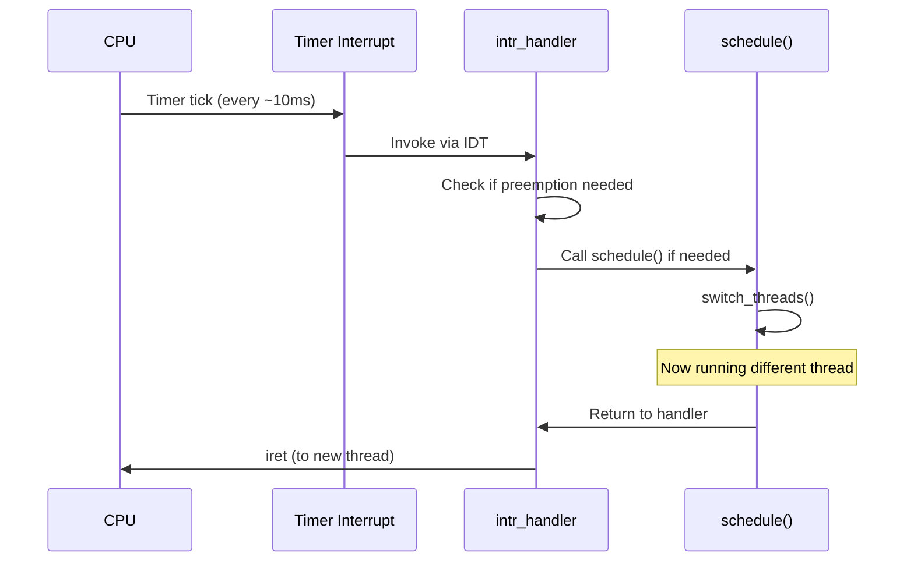

import CodeWalkthrough from '@site/src/components/CodeWalkthrough';
import AnimatedFlow from '@site/src/components/AnimatedFlow';

# Context Switching

Context switching is the mechanism by which the CPU switches from executing one thread to another.

## What Gets Saved?

When switching threads, we must preserve:

| Category | Registers | Purpose |
|----------|-----------|---------|
| **General Purpose** | EAX, EBX, ECX, EDX | Computation |
| **Stack** | ESP, EBP | Stack management |
| **Instruction** | EIP | Next instruction |
| **Segment** | CS, DS, SS, ES | Memory segments |
| **Flags** | EFLAGS | CPU state |

## The Switch Process

<AnimatedFlow
  title="Context Switch Flow"
  states={[
    { id: 'running-a', label: 'Thread A Running', color: '#22c55e' },
    { id: 'save-a', label: 'Save A Registers', color: '#f59e0b' },
    { id: 'switch-stack', label: 'Switch Stack Pointer', color: '#8b5cf6' },
    { id: 'restore-b', label: 'Restore B Registers', color: '#f59e0b' },
    { id: 'running-b', label: 'Thread B Running', color: '#22c55e' },
  ]}
  transitions={[
    { from: 'running-a', to: 'save-a', label: 'Interrupt or yield' },
    { from: 'save-a', to: 'switch-stack', label: 'Push to A stack' },
    { from: 'switch-stack', to: 'restore-b', label: 'Load B stack ptr' },
    { from: 'restore-b', to: 'running-b', label: 'Pop from B stack' },
  ]}
  autoPlay={false}
/>

## The Code: switch.S

The heart of context switching is in `threads/switch.S`:

<CodeWalkthrough
  title="switch_threads() in switch.S"
  sourceFile="threads/switch.S"
  language="asm"
  code={`switch_threads:
    # Save caller's registers
    pushl %ebx
    pushl %ebp
    pushl %esi
    pushl %edi

    # Get current thread's stack location
    mov thread_current, %eax
    call *%eax
    movl %esp, (%eax)

    # Switch to new thread's stack
    movl 20(%esp), %ecx
    movl (%ecx), %esp

    # Restore new thread's registers
    popl %edi
    popl %esi
    popl %ebp
    popl %ebx
    ret`}
  steps={[
    {
      lines: [1, 5],
      title: "Save Callee-Saved Registers",
      explanation: "Push EBX, EBP, ESI, EDI onto the current thread's stack. These are the registers that functions must preserve according to the C calling convention."
    },
    {
      lines: [7, 9],
      title: "Save Stack Pointer",
      explanation: "Call thread_current() to get a pointer to the current thread's struct thread, then save ESP to the thread's stack field. This captures our exact position."
    },
    {
      lines: [11, 13],
      title: "Switch Stacks",
      explanation: "Get the new thread from the stack argument (at offset 20 due to our pushes), then load its saved stack pointer into ESP. We're now on the new thread's stack!"
    },
    {
      lines: [15, 19],
      title: "Restore New Thread's State",
      explanation: "Pop the registers that were saved when this thread was switched out. The 'ret' instruction pops the return address and jumps there, resuming the new thread."
    },
  ]}
/>

## Stack Layout During Switch

```
Thread A's Stack (before switch)    Thread B's Stack (before switch)
┌─────────────────────────┐         ┌─────────────────────────┐
│    ... (higher)         │         │    ... (higher)         │
├─────────────────────────┤         ├─────────────────────────┤
│   Return address        │         │   Return address        │
├─────────────────────────┤         ├─────────────────────────┤
│   Saved EBX             │         │   Saved EBX             │
├─────────────────────────┤         ├─────────────────────────┤
│   Saved EBP             │         │   Saved EBP             │
├─────────────────────────┤         ├─────────────────────────┤
│   Saved ESI             │         │   Saved ESI             │
├─────────────────────────┤         ├─────────────────────────┤
│   Saved EDI             │ ← ESP   │   Saved EDI             │
└─────────────────────────┘         └─────────────────────────┘
                                              ↑
                                    Will become ESP after switch
```

## The C Side: schedule()

The `schedule()` function in `thread.c` orchestrates the switch:

```c
static void schedule(void) {
  struct thread *cur = running_thread();
  struct thread *next = next_thread_to_run();
  struct thread *prev = NULL;

  ASSERT(intr_get_level() == INTR_OFF);
  ASSERT(cur->status != THREAD_RUNNING);
  ASSERT(is_thread(next));

  if (cur != next)
    prev = switch_threads(cur, next);  /* The magic happens here */

  thread_schedule_tail(prev);
}
```

## When Does Context Switch Happen?

| Trigger | Function | Voluntary? |
|---------|----------|------------|
| Thread yields | `thread_yield()` | Yes |
| Thread blocks | `thread_block()` | Yes |
| Thread exits | `thread_exit()` | Yes |
| Timer interrupt | `timer_interrupt()` | No |
| Higher priority ready | `thread_unblock()` | No |

## Interrupt-Driven Preemption



## First Thread Switch

When a newly created thread runs for the first time, it starts at `kernel_thread()`:

```c
static void kernel_thread(thread_func *function, void *aux) {
  ASSERT(function != NULL);

  intr_enable();       /* Enable interrupts */
  function(aux);       /* Execute thread function */
  thread_exit();       /* Exit when done */
}
```

## Performance Considerations

Context switching has costs:

1. **Direct Costs**
   - Register save/restore: ~100 cycles
   - Stack switch: ~10 cycles

2. **Indirect Costs**
   - Cache pollution: New thread has cold cache
   - TLB flush: If switching processes (~1000 cycles)
   - Pipeline flush: CPU pipeline is drained

:::tip Minimizing Switch Overhead
- Avoid unnecessary blocking
- Use appropriate synchronization granularity
- Consider thread pools for short tasks
:::

## Next Steps

- [Synchronization](/docs/concepts/synchronization) - Locks, semaphores, conditions
- [Deep Dive: Context Switch Assembly](/docs/deep-dives/context-switch-assembly) - Line-by-line analysis
