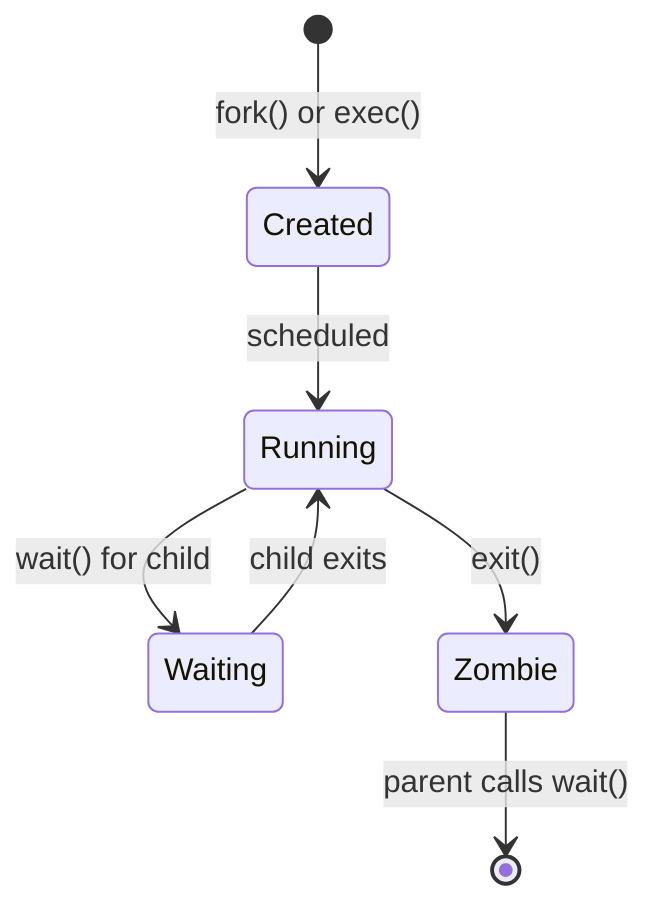

import AnimatedFlow from '@site/src/components/AnimatedFlow';
import MemoryLayout from '@site/src/components/MemoryLayout';

# Threads and Processes

Understanding the difference between threads and processes is fundamental to operating systems.

## Key Concepts

| Concept | Thread | Process |
|---------|--------|---------|
| **Definition** | Unit of CPU scheduling | Unit of resource ownership |
| **Address Space** | Shares with other threads | Has its own isolated space |
| **Creation Cost** | Lightweight | Heavyweight |
| **Context Switch** | Fast (no TLB flush) | Slow (TLB flush needed) |
| **Communication** | Shared memory | IPC required |

## Thread States

A thread in PintOS can be in one of four states:

<AnimatedFlow
  title="Thread State Transitions"
  states={[
    { id: 'blocked', label: 'BLOCKED', color: '#ef4444' },
    { id: 'ready', label: 'READY', color: '#f59e0b' },
    { id: 'running', label: 'RUNNING', color: '#22c55e' },
    { id: 'dying', label: 'DYING', color: '#6b7280' },
  ]}
  transitions={[
    { from: 'blocked', to: 'ready', label: 'thread_unblock()' },
    { from: 'ready', to: 'running', label: 'schedule()' },
    { from: 'running', to: 'ready', label: 'thread_yield()' },
    { from: 'running', to: 'blocked', label: 'thread_block()' },
    { from: 'running', to: 'dying', label: 'thread_exit()' },
  ]}
/>

### State Descriptions

- **BLOCKED**: Waiting for an event (lock, semaphore, timer, I/O)
- **READY**: Eligible to run, waiting in the ready queue
- **RUNNING**: Currently executing on the CPU
- **DYING**: About to be destroyed, cleanup in progress

## Thread Control Block

Each thread is represented by a `struct thread`:

```c
struct thread {
  /* Owned by thread.c */
  tid_t tid;                    /* Thread identifier */
  enum thread_status status;    /* Thread state */
  char name[16];                /* Name (for debugging) */
  uint8_t *stack;               /* Saved stack pointer */
  int priority;                 /* Base priority (0-63) */
  struct list_elem allelem;     /* Element in all_list */
  struct list_elem elem;        /* Element in ready_list */

  /* Owned by synch.c (for priority donation) */
  int eff_priority;             /* Effective priority */
  struct lock *waiting_lock;    /* Lock we're waiting for */
  struct list held_locks;       /* Locks we hold */

  /* Owned by process.c (for user threads) */
  uint32_t *pagedir;            /* Page directory */
  struct file *executable;      /* Our executable */

  /* Stack canary for overflow detection */
  unsigned magic;
};
```

## Thread Memory Layout

<MemoryLayout
  title="Thread Stack (4 KB Page)"
  regions={[
    {
      id: 'thread',
      label: 'struct thread',
      startAddress: '0xXXXXX000 + 4KB',
      endAddress: '0xXXXXXFFF',
      size: '~200 bytes',
      color: 'kernel',
      description: 'Thread control block at top of page',
    },
    {
      id: 'unused',
      label: 'Unused Space',
      startAddress: '',
      endAddress: '',
      color: 'free',
      description: 'Available for stack growth',
    },
    {
      id: 'stack',
      label: 'Kernel Stack',
      startAddress: '0xXXXXX000',
      endAddress: 'grows up',
      size: '~3.8 KB',
      color: 'stack',
      description: 'Stack grows toward struct thread',
    },
  ]}
  showAddresses={false}
/>

Finding the current thread is fast:

```c
struct thread *thread_current(void) {
  uint32_t *esp;
  asm ("mov %%esp, %0" : "=g" (esp));
  return pg_round_down(esp);  /* Round down to page boundary */
}
```

## Creating a Thread

```c
tid_t thread_create(const char *name, int priority,
                    thread_func *function, void *aux) {
  struct thread *t;
  struct kernel_thread_frame *kf;

  /* Allocate thread page */
  t = palloc_get_page(PAL_ZERO);
  if (t == NULL)
    return TID_ERROR;

  /* Initialize thread */
  init_thread(t, name, priority);
  t->tid = allocate_tid();

  /* Set up kernel thread frame */
  kf = alloc_frame(t, sizeof *kf);
  kf->eip = NULL;
  kf->function = function;
  kf->aux = aux;

  /* Add to ready queue */
  thread_unblock(t);

  return t->tid;
}
```

## Processes in PintOS

In PintOS, a process is a thread with:
- Its own **page directory** (address space)
- An **executable file** it's running
- **File descriptors** for open files
- **Child process list** for wait/exit

### Process Creation (`fork`)

```c
pid_t fork(void) {
  struct thread *parent = thread_current();
  struct thread *child;

  /* Create child thread */
  child = thread_create(parent->name, parent->priority, ...);

  /* Clone address space (with COW) */
  child->pagedir = pagedir_clone(parent->pagedir);

  /* Copy file descriptors */
  copy_fds(parent, child);

  return child->tid;
}
```

### Process Lifecycle



## Thread vs Process Context Switch

### Thread Switch (Same Process)
1. Save registers to stack
2. Switch stack pointers
3. Restore registers from new stack
4. **No TLB flush needed**

### Process Switch
1. Save registers to stack
2. Switch stack pointers
3. **Load new page directory (CR3)**
4. **TLB automatically flushed**
5. Restore registers from new stack

## Code Location

| Concept | File | Key Functions |
|---------|------|---------------|
| Thread lifecycle | `threads/thread.c` | `thread_create()`, `thread_exit()` |
| Context switch | `threads/switch.S` | `switch_threads()` |
| Process management | `userprog/process.c` | `process_execute()`, `process_wait()` |
| Fork implementation | `userprog/process.c` | `fork()` |

## Quiz: Test Your Understanding

import Quiz from '@site/src/components/Quiz';

<Quiz
  title="Threads vs Processes"
  topic="fundamentals"
  questions={[
    {
      question: "What is the main difference between a thread and a process?",
      options: [
        { text: "Threads share address space; processes have isolated spaces", isCorrect: true },
        { text: "Processes are faster to create than threads", isCorrect: false },
        { text: "Threads cannot share data with each other", isCorrect: false },
        { text: "Processes run in user mode; threads run in kernel mode", isCorrect: false },
      ],
      explanation: "Threads within the same process share the virtual address space, making communication easy but requiring synchronization. Processes are isolated for protection.",
    },
    {
      question: "Why is switching between threads in the same process faster than switching between processes?",
      options: [
        { text: "Thread stacks are smaller", isCorrect: false },
        { text: "No TLB flush is required", isCorrect: true },
        { text: "Threads have fewer registers", isCorrect: false },
        { text: "The scheduler is simpler", isCorrect: false },
      ],
      explanation: "When switching between threads in the same process, the page directory stays the same, so the TLB (Translation Lookaside Buffer) doesn't need to be flushed. Process switches require loading a new CR3 value, which invalidates the TLB.",
    },
  ]}
/>

## Next Steps

- [Context Switching](/docs/concepts/context-switching) - How the CPU switches between threads
- [Synchronization](/docs/concepts/synchronization) - Coordinating between threads
