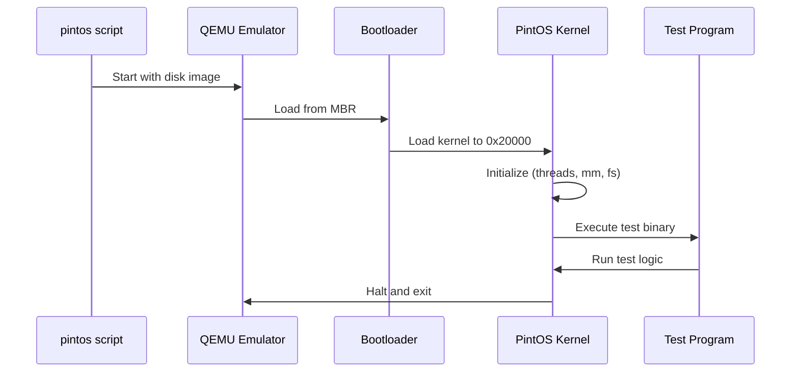

# First Run

Let's run your first PintOS test and understand what's happening.

## Running a Test

After building, navigate to the build directory and run a test:

```bash
cd src/threads/build
pintos --qemu -- run alarm-multiple
```

### Understanding the Command

- `pintos` - The PintOS runner script
- `--qemu` - Use QEMU as the emulator (vs `--bochs`)
- `--` - Separates runner options from kernel options
- `run alarm-multiple` - Run the `alarm-multiple` test

## Test Output

A successful test produces output like:

```
Booting from Hard Disk...
Pintos booting with 4,096 kB RAM...
...
Kernel command line: run alarm-multiple
Executing 'alarm-multiple':
(alarm-multiple) begin
(alarm-multiple) Creating 5 threads to sleep 1 times each.
(alarm-multiple) Thread 0 sleeps 10 ticks each time,
(alarm-multiple) thread 1 sleeps 20 ticks each time, and so on.
(alarm-multiple) If successful, product of iteration count and
(alarm-multiple) temporary variable should equal 0.
(alarm-multiple) actual 0=0: PASSED
(alarm-multiple) end
Execution of 'alarm-multiple' complete.
```

## Running All Tests

To run the complete test suite for a project:

```bash
cd src/threads
make check
```

This runs all tests and produces a grade summary:

```
pass tests/threads/alarm-single
pass tests/threads/alarm-multiple
pass tests/threads/alarm-simultaneous
...
All 27 tests passed.
```

## Running Individual Tests

### Run and Grade a Single Test

```bash
make tests/threads/priority-donate-chain.result
```

### View Test Output

```bash
cat tests/threads/priority-donate-chain.output
```

### View Expected Output

```bash
cat tests/threads/priority-donate-chain.ck
```

## Test Categories

### Threads Tests

| Test Pattern | Description |
|--------------|-------------|
| `alarm-*` | Timer and sleeping |
| `priority-*` | Priority scheduling |
| `priority-donate-*` | Priority donation |
| `mlfqs-*` | MLFQS scheduler |

### User Program Tests

| Test Pattern | Description |
|--------------|-------------|
| `args-*` | Argument passing |
| `exec-*` | Process execution |
| `wait-*` | Process waiting |
| `open-*`, `read-*`, `write-*` | File operations |
| `fork-*` | Process forking |

## Interactive Mode

You can run PintOS interactively to execute shell commands:

```bash
pintos --qemu -- -q run 'cat README'
```

Or start an interactive session:

```bash
pintos --qemu --
```

:::tip
Use `-q` flag to quit after the command completes. Without it, PintOS waits for more input.
:::

## What's Actually Happening

When you run a test, here's the sequence:



1. **Boot**: QEMU loads the bootloader from the disk image
2. **Kernel Load**: Bootloader loads the kernel into memory
3. **Initialization**: Kernel initializes subsystems (threads, memory, devices)
4. **Test Execution**: Kernel runs the specified test
5. **Completion**: Test completes and kernel halts

## Next Steps

- [Debugging](/docs/getting-started/debugging) - Learn to debug with GDB
- [Project 1 Overview](/docs/projects/threads/overview) - Start implementing
